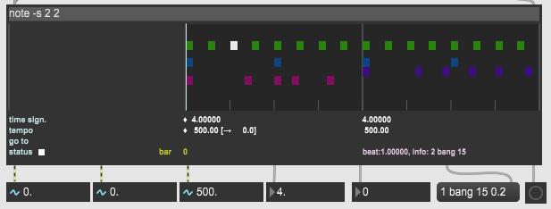
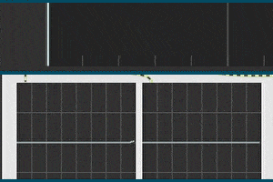

# About

fl_batuta~ is an audio external for Max/MSP written in C. 'Batuta' is the spanish word for 'baton', the stick conductors use when directing a music ensamble. This external allows you to store and organize messages to play them in a chronological sequence similar to a music tracker.
In the same way a music score works, the external organizes time in bars, each bar has a time signature which divides the bar in beats, and the speed is controled by tempo. Repeat signs are called 'gotos' and have the same purpose. The bar is also divided in channels to identify every group of messages that will be called notes. The main differences with musical theory are that: 
- bars are measured from beat 0.0 instead of 1, much like a temporal ruler (also every indexation starts from 0) 
- the time signature isn't a ratio that uses different kinds of figures, it's just a fixed amount of beats that can also be a decimal number. i.e: 3.5 beats -> 7/8 time signature 
- the tempo is measured in time periods for each beat (in milliseconds) instead of a frequency. 500 ms -> 120 BPM.

This external works in 3 stages: editing, playing and loading. For the edit stage, the external uses linked lists to store and sort efficiently the different structs: bars, tempos, time signatures, gotos and notes. Then, an array of pointers is updated with the addresses of every struct to be accessed easily on the playing stage. Reading and writing a file are the loading stage.

Notice that the API says this about the t_linklist struct: "_A linklist element. This struct is provided for debugging convenience, but should be considered opaque and is subject to change without notice_". For this reason, using the 7.1.0 API version to build this project is highly recommended since its the only version that has been tested with. 

A compiled external (.mxe64) and a help file (.maxhelp) are provided in the example folder, as always.

### Inlets and Outlets

(From left to right)

**Inlets:**
- (int) on/off switch (play/edit)
- (int) next bar/set bar (play/edit) 

**Outlets:**
- (sig~) beat normalized ramp for syncing purposes
- (sig~) bar normalized ramp for syncing purposes
- (sig~) tempo
- (float) time signature
- (float) current bar index when playing
- (message) note channel and info
- (bang) end flag

# Versions History

**0.2** 
- Error handling for 'out of memory' cases and linklist function error returns
- t_atomarray replaced with t_atom dynamic memory allocation

**0.3**
- 'rec' function added
- 'quantize' and 'human' functions added

**0.4** 
- GUI added
- Storage in text file

**0.5** 
- Texfield and command instructions added
- Note selection with mouse

**0.6** 
- Comments and variables translated to english
- A default bar/tempo/time signature is added if element in first bar is deleted
- Info display on console corrected
- Note selection with mouse removed
- Storage in data file (replaces storage in text file)
